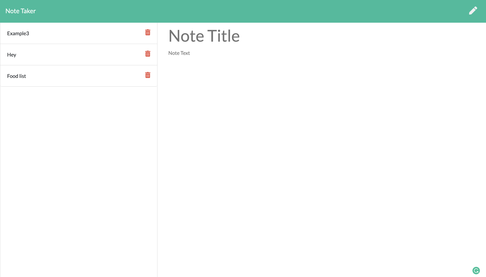

# Note-Taker
This is an application that can be used to write, save, and delete notes. This application will use an express backend and save and retrieve notes data from a JSON file.

## User Story

AS a user, I want to be able to write and save notes

I want to be able to delete notes I've written before

SO that I can organize my thoughts and keep track of tasks I need to complete

